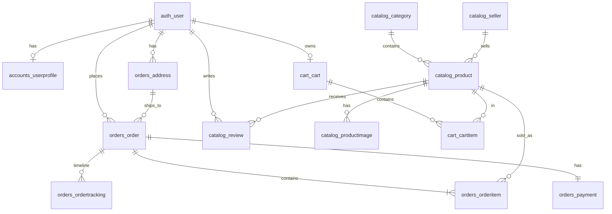

# Database Schema

Django **migrations** create the real tables. This document describes the logical schema for viva and matches `backend/sql_scripts/schema.sql`.

**Table naming:** Django uses `app_label_modelname` (e.g. `catalog_product`).

---

## ER diagram (logical)



---

## Core tables

### Users & profile

| Table | Key columns | Notes |
|-------|-------------|-------|
| `auth_user` | `id`, `username`, `email`, `password` | Django built-in |
| `accounts_userprofile` | `user_id` (FK, unique), `phone`, `created_at` | Extended profile |

### Catalog

| Table | Key columns | Notes |
|-------|-------------|-------|
| `catalog_category` | `id`, `name`, `slug`, `description` | Electronics, Beauty, etc. |
| `catalog_seller` | `id`, `name`, `slug`, `rating`, `verified` | Marketplace sellers |
| `catalog_product` | `id`, `category_id`, `seller_id`, `name`, `slug`, `price`, `stock_quantity`, `is_active` | Main product table |
| `catalog_productimage` | `product_id`, `image_url`, `sort_order`, `is_primary` | Gallery images |
| `catalog_review` | `product_id`, `user_id`, `rating`, `title`, `comment` | Unique (product, user) |

### Cart

| Table | Key columns | Notes |
|-------|-------------|-------|
| `cart_cart` | `id`, `user_id` (unique) | One cart per user |
| `cart_cartitem` | `cart_id`, `product_id`, `quantity` | Unique (cart, product) |

### Orders

| Table | Key columns | Notes |
|-------|-------------|-------|
| `orders_address` | `user_id`, `full_name`, `line1`, `city`, `state`, `pincode`, `is_default` | Saved addresses |
| `orders_order` | `user_id`, `address_id`, `total_amount`, `status`, `order_date` | Order header |
| `orders_orderitem` | `order_id`, `product_id`, `quantity`, `unit_price`, `subtotal` | Line items |
| `orders_payment` | `order_id` (unique), `payment_method`, `amount`, `status`, `transaction_id` | 1:1 with order |
| `orders_ordertracking` | `order_id`, `status`, `message`, `location`, `recorded_at` | Status timeline |

---

## Order status values

`pending` → `confirmed` → `processing` → `shipped` → `out_for_delivery` → `delivered`  
Or: `cancelled`

## Payment status values

`pending` | `success` | `failed` | `refunded`

## Payment methods (checkout)

- `razorpay` — online demo gateway
- `cod` — Cash on Delivery

---

## Indexes (important for viva)

| Table | Index | Purpose |
|-------|-------|---------|
| `catalog_product` | `(category_id, is_active)` | Category browse |
| `catalog_product` | `slug` | Product detail URL |
| `orders_order` | `(user_id, status)` | User order list |
| `orders_orderitem` | `(order_id, product_id)` | Order lines |
| `orders_ordertracking` | `(order_id, recorded_at)` | Timeline |

---

## How tables are created

**Do not run `schema.sql` instead of migrate** on a fresh Django project — migrations also create `auth_*`, `django_*` tables.

Recommended order:

```powershell
cd backend
python manage.py migrate      # Django creates all tables
python manage.py seed_data    # Inserts demo rows
```

`schema.sql` is a **reference copy** for viva / MySQL Workbench documentation.

---

## Sample queries (viva)

```sql
-- Products with category name
SELECT p.name, c.name AS category, p.price, p.stock_quantity
FROM catalog_product p
JOIN catalog_category c ON c.id = p.category_id
WHERE p.is_active = 1;

-- User cart value
SELECT u.username, SUM(ci.quantity * pr.price) AS cart_total
FROM auth_user u
JOIN cart_cart cart ON cart.user_id = u.id
JOIN cart_cartitem ci ON ci.cart_id = cart.id
JOIN catalog_product pr ON pr.id = ci.product_id
GROUP BY u.id;

-- Orders with payment status
SELECT o.id, u.username, o.total_amount, o.status, pay.status AS payment_status
FROM orders_order o
JOIN auth_user u ON u.id = o.user_id
LEFT JOIN orders_payment pay ON pay.order_id = o.id;
```

---

## See also

- [SQL_SCRIPTS.md](SQL_SCRIPTS.md) — views and triggers
- [MYSQL_SETUP.md](MYSQL_SETUP.md) — connect with username/password
- App UI: `/db-insights/` (staff login) — live schema + sample rows
